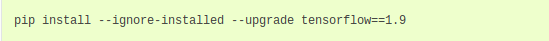

# Object-Detection-Project 
Click this to follow along: [Original Guide](https://tensorflow-object-detection-api-tutorial.readthedocs.io/en/latest/install.html#general-remarks)

Step 1 
- Install Ubuntu for your VB here: https://ubuntu.com/#download
- Allocate at least 20gb of space.
- Make sure hardware settings in VB are reasonably high.
- During installation, select "minimal installation".
- Adjust screen resolution by going to the Settings/Devices
  Optional: To fit display into screen, set VM to scaled mode.
- Update software if needed.
- Install Gueast Addition if VM doesn't allow drag n drop. Restart VM if needed.
  
 Step 2
 - Install "Anaconda Python 3.7" for Linux with https://www.anaconda.com/distribution/
   > Remember to select the right distribution (Linux) because the default download link is for Windows.
 - Verify complete installation by following the instructions in https://docs.anaconda.com/anaconda/install/linux/
   > If the hash code doesn't match, delete everything from Step 2 and try Step 2 again.
 
***TIP*** 
Instead of typing the entire .sh file one by one, press tab to have everything typed out for you; with the condition that you're in the directory that has that file (In our case, it's in Downloads)

 Step 3
 - Install Tensorflow by folowing the instructions under "Tensorflow CPU"
   > We didn't choose to go with "Tensorflow GPU" due to hardware limitations.
   
   > The part where it says, "Once you have activated your virtual environment, the name of the environment should be displayed..." doesn't apply to us since we're not using Windows.
 
 ***NOTE***
 
 
 
   
